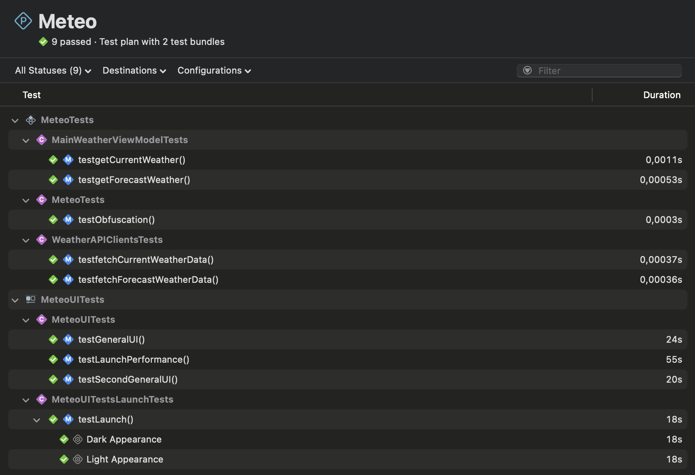

# Meteo - a weather app exercise 

This is an exercise by Josue Muhiri Cizungu to create an iOS app using Swift to display the weather.

Functionality:
- Display the weather of current location (user permission needed)
- Save current location as `favorite`
- View saved favorites via side menu (slide in/slide out)
- View weather of saved `favorite` location
- Map to view all favorites location
- Ability to add favorite location from map via long press 
- Ability to change themes

External libraries used: 
- SwiftLint (Used for static code analysis)

## How to build and run test

```
pod install
```
xcode cli can be used to run 
- Unit tests
- UI Tests

```
xcodebuild clean test -workspace Meteo.xcworkspace -scheme Meteo -destination 'platform=iOS Simulator,id=319BCE96-E12C-41D1-B0FC-028BD2D04AA4,OS=17.0,name=iPhone SE (3rd generation)'
```
Or use Xcode.app




### How to use the app

* Open side menu:
    - From main page (after opening the app)
    - Swipe left to right to open side menu
* Open detailed view per day:
    - From main page (after opening the app)
    - Click on a forecast day to open detailed view
* Save current location as favorite
    - From main page (after opening the app)
    - Swipe left to right to open side menu
    - Click on plus button next to favorite
    - An alert view will pop up including an input textfield, prefilled with your suburb name if found. This can be customized by clicking on it.
    - Click save 

If you open the side menu again, the favorites should be on the side menu.
Clicking on the favorite will load the weather for that area

* Save chosen location as favorite from map
    - From main page (after opening the app)
    - Swipe left to right to open side menu
    - Click on map
    - Select point on the map by using a long press for at least 2 seconds
    - An alert view will pop up including 3 input textfield, prefilled with your suburb name if found, plus your latitude and your longitude. This can be customized by clicking on it.
    - Click save 

If you open the side menu again, the favorites should be on the side menu.
Clicking on the favorite will load the weather for that area

* Change themes
    - From main page (after opening the app)
    - Swipe left to right to open side menu
    - At the bottom of the side menu, chose your theme with the selector

This will change the theme to Sea or Forest

